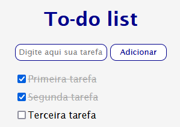

### To-do list

Neste projeto criei uma lista de tarefas.

Isntruções que foram seguidas:

    Crie um campo de input de texto e um botão para adicionar a tarefa à lista;
    Quando o botão for pressionado, o texto deve aparecer na lista com um checkbox ao lado;
    Quando o usuário selecionar o checkbox, o item correspondente deve ficar com o texto riscado.
    

Resultado esperado:

