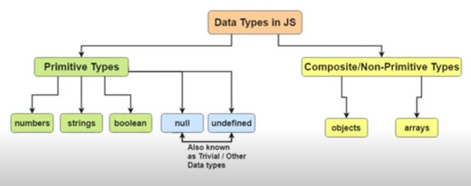

## Atribuição de valores

*Camel case* é muito utilizado no JavaScritp para funções e variáveis
*Upper Case Snake Case* é muito utilizado para constantes
 
 

### var / let

#### var
Escopo global 
Possível atribuir valor antes de declarar a variável (hoisting) 
Permite redeclaração e reatribuição 

#### let
Escopo dentro de um bloco 
não faz hoisting 
Permite reatribuição 
Mais seguro 
  

### const
Declarada em SNAKE_UPPER_CASE 
Escopo de bloco 
Não faz hoisting 
Não permite redeclaração e reatribuição 
  

### Resumo
| |var|const|let|
|:--:|:--:|:--:|:--:|
escopo|global ou local|bloco|bloco
redeclarar|sim|não|não
reatribuir|sim|não|sim
hoisting|sim|não|não

  

## Tipos de valores

### Estruturas de dados
JavaScript possuí tipagem fraca/dinâmica, ou seja, antes de declarar um valor não é especificado o **tipo** dele.

Tipos de dados em JavaScript

Dica: Utilizar a biblioteca Math para lidar com números.

## Atividades da aula

### Atividade 01
Verifique, de duas maneiras diferentes entre si, se uma String é um palíndromo.

Palíndromo: frase ou palavra que se pode ler, indiferentemente, da esquerda para a direita ou vice-versa (ex.: raiar, ama, ovo, radar)

### Atividade 02
Troque todos os elementos pares e diferentes de zero de um array pelo número 0. Se o array for vazio, retorne -1.

Exemplo: Input -> [1, 3, 4, 6, 80, 33, 23, 90]

Output -> [1, 3, 0, 0, 0, 33, 23, 0]

Input -> []

Output -> -1